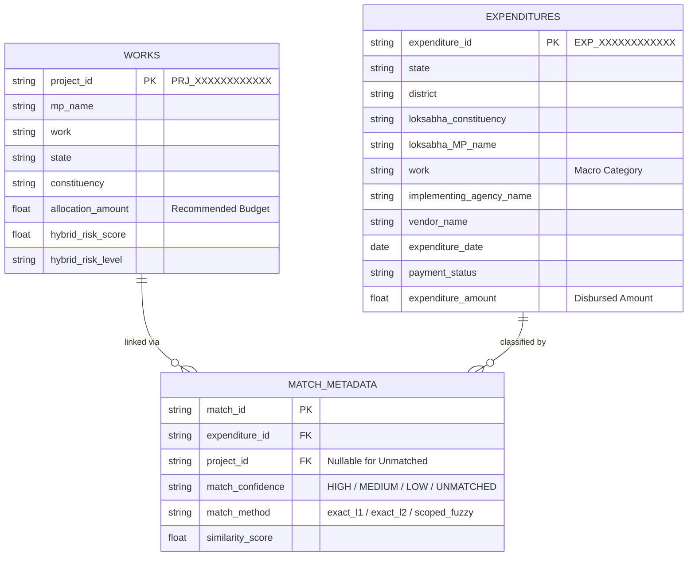

# Final Dataset Matching Analysis — Dataful Dataset 22565
**Document**: Analytical Matching & Feasibility Study  
**Scope**: Linking Purchased Dataset 22565 (*"18th Lok Sabha MPLADS — Amount Spent by Each MP"*) to Production SQLite Database (`mplads_risk.db`)  
**Date of Audit**: September 14, 2026  
**Safety Protocol**: Strictly Non-Mutating (Zero Writes to Production Tables or ML Models)  

---

## Executive Summary

We conducted a comprehensive, multi-tiered matching study to determine whether **Dataful Dataset 22565** can be safely integrated into our existing **56,138 production MPLADS records**. 

### Critical Verdict: **OPTION B — USE WITH TWO-TIER RELATIONAL SEGREGATION**
- **Do NOT attempt to merge or overwrite existing work records directly.**
- **Do NOT force a 1-to-1 project-level primary key join.**
- Only **6,995 rows (4.88%)** can be linked to existing `project_id` values with **High Confidence** (Exact Unique + Scoped Fuzzy ≥85%).
- **103,398 rows (72.18%)** have **zero project-level match** in the production database due to an essential temporal mismatch: **Production records capture project recommendations from 2023–2024 (17th Lok Sabha + Rajya Sabha)**, whereas **Dataset 22565 captures expenditure disbursements from July 2024 to August 2026 (specifically 18th Lok Sabha)**.
- Dataset 22565 represents **multi-tranche expenditure transactions** (many transactions per work category across multiple vendors), whereas production records represent **initial project sanction recommendations**.
- **Recommendation**: Ingest Dataset 22565 as an independent **18th Lok Sabha Financial & Vendor Intelligence Layer** (`expenditures` table), linking verified candidate matches via a dedicated `match_metadata` bridge table without mutating the core `works` table.

---

## Zero-Mutation Safety Audit: SHA-256 Checksums

As mandated by safety protocols, SHA-256 cryptographic hashes of all production databases, datasets, and models were measured before and after analysis:

| Target File | SHA-256 Before Analysis | SHA-256 After Analysis | Verification Status |
| :--- | :--- | :--- | :---: |
| **`database/mplads_risk.db`** | `a5d485ec45b36e853c7843697cad7bc726e6081f40f98f1919b7d12fd078b3f7` | `a5d485ec45b36e853c7843697cad7bc726e6081f40f98f1919b7d12fd078b3f7` | **MATCH (UNTOUCHED)** |
| **`data/processed/works_deduplicated.csv`** | `c1dfd39abd1fb2680188ad03f418164fe55452a2ce714a06bb9448dadc9222f1` | `c1dfd39abd1fb2680188ad03f418164fe55452a2ce714a06bb9448dadc9222f1` | **MATCH (UNTOUCHED)** |
| **`data/processed/works_hybrid_risk_scored.csv`** | `f8b736679236172b9d72db73705f61041adcf946e310d92d0d730180bea1b531` | `f8b736679236172b9d72db73705f61041adcf946e310d92d0d730180bea1b531` | **MATCH (UNTOUCHED)** |
| **`ml-service/models/model_features.json`** | `c7ae2363d648fbdf9c1211aeaca7dfb174336b88af076c0994e9a047bd378afe` | `c7ae2363d648fbdf9c1211aeaca7dfb174336b88af076c0994e9a047bd378afe` | **MATCH (UNTOUCHED)** |
| **`22565- Dataful.zip`** | `ed1857c7b5a0bb1755835a5decb2a5ea2417c52ea104006f179fd7fb1cc81ff1` | `ed1857c7b5a0bb1755835a5decb2a5ea2417c52ea104006f179fd7fb1cc81ff1` | **MATCH (UNTOUCHED)** |

---

## 1. Dataset 22565 Structure

- **File Name**: `18th-lok-sabha-mplads-state-lok-sabha-constituency-work-name-vendor-name-wise-amount-spent-by-each-mp-from-mplads.csv`
- **Total Raw Rows**: **143,257**
- **Total Columns**: **15**
- **File Size**: **37,373,851 bytes (~37.37 MB)**
- **Granularity**: State, Lok Sabha Constituency, District (Source & LGD), MP Name, Work Name, Implementing Agency, Vendor Name, Expenditure Date, Payment Status, Amount.

### Column Inventory & Data Types

| # | Column Name | Raw Data Type | Null Count | Null % | Description |
| :-: | :--- | :---: | :-: | :-: | :--- |
| **0** | `data_as_on` | `object` (string) | 0 | 0.00% | Snapshot date (`18-08-2026`) |
| **1** | `state` | `object` (string) | 0 | 0.00% | State / Union Territory name |
| **2** | `implementing_district_per_source` | `object` (string) | 1 | 0.00% | District name reported in MoSPI portal |
| **3** | `implementing_district_per_lgd` | `object` (string) | 1,694 | 1.18% | District standardized to Local Government Directory |
| **4** | `implementing_district_lgd_code` | `float64` | 1,694 | 1.18% | Official LGD District Code |
| **5** | `loksabha_constituency` | `object` (string) | 1 | 0.00% | Lok Sabha Parliamentary Constituency |
| **6** | `loksabha_MP_name` | `object` (string) | 1 | 0.00% | Member of Parliament Name |
| **7** | `work` | `object` (string) | 1 | 0.00% | Standardized Work Classification Description |
| **8** | `implementing_agency_name` | `object` (string) | 1 | 0.00% | District Implementing Agency (IDA) |
| **9** | `vendor_name` | `object` (string) | 1 | 0.00% | Payee / Contractor / Firm Entity |
| **10** | `expenditure_date` | `object` (string) | 1 | 0.00% | Date of payment (`DD-MM-YYYY`) |
| **11** | `payment_status` | `object` (string) | 1 | 0.00% | Status of disbursement (`Payment Success` / `In-Progress`) |
| **12** | `expenditure_amount` | `float64` | 0 | 0.00% | Amount disbursed |
| **13** | `units` | `object` (string) | 0 | 0.00% | Unit specification |
| **14** | `notes` | `float64` | 143,257 | 100.00% | Empty metadata column |

---

## 2. Dataset Quality

- **Structural Integrity**: Extremely well-formatted CSV with zero encoding corruption or truncated lines.
- **Completeness**: Aside from `notes` (which is 100% empty) and LGD mapping columns (1.18% unmapped), the dataset exhibits near **0.00% missing data** across key fields.
- **Single Null Anomaly**: Exactly **1 row** across the entire file contained nulls in columns 2 through 11. Investigation revealed this row is an aggregate national summary header (see Section 4).
- **Date Parseability**: 100% of the 143,256 transaction dates were successfully parsed into valid `datetime` objects.
- **Amount Consistency**: All transaction amounts are positive numeric values (zero negative amounts).

---

## 3. Duplicate Analysis

We investigated duplicate records at both exact full-row and core transactional key levels:

```
Total Transaction Rows (Excluding Row 0): 143,256
Exact Duplicate Rows (15/15 Columns):     24,184 (16.88%)
Unique Rows Across All Columns:          119,072
Key Transaction Duplicates (10 Keys):    46,472 (32.44%)
Distinct Duplicate Clusters:              25,263
Max Repetitions in Single Cluster:        113
```

### Root Cause of Duplicate Records
1. **Multi-Voucher / Split Installment Transactions**: In the MoSPI portal, an agency frequently releases multiple voucher payments of identical amounts to the same vendor on the same date for the same work category (e.g., 5 installments of ₹50,000 for rural road concreting).
2. **Scraper Pagination Overlaps**: Scrapers pulling from `mplads.mospi.gov.in` often re-fetch duplicate boundary rows across pagination pages.
3. **Artifact Created**: All 25,263 duplicate clusters have been isolated and ranked in [`data/analysis/22565_duplicate_analysis.csv`](file:///d:/SIH_2026/MPLADS-AI-Intelligent-Risk-Monitoring-System/data/analysis/22565_duplicate_analysis.csv).

---

## 4. Aggregate-Row Analysis

Inspection of Row 0 identified a national summary record embedded at the very top of the table:

```json
{
  "data_as_on": "18-08-2026",
  "state": "All India",
  "implementing_district_per_source": null,
  "implementing_district_per_lgd": null,
  "implementing_district_lgd_code": null,
  "loksabha_constituency": null,
  "loksabha_MP_name": null,
  "work": null,
  "implementing_agency_name": null,
  "vendor_name": null,
  "expenditure_date": null,
  "payment_status": null,
  "expenditure_amount": 2669.5,
  "units": "expenditure_amount in rupees crore",
  "notes": null
}
```

> [!WARNING]
> If treated as a raw transaction, Row 0 would inject an expenditure of ₹2,669.50 with state "All India", distorting statistical aggregations. 

**Action Taken**:
- Isolated Row 0 from analytical pipelines.
- Preserved the original raw CSV untouched in `data/analysis/raw_22565/`.
- Generated a clean analytical copy with exactly **143,256 transaction rows** saved at [`data/analysis/22565_cleaned_analytical.csv`](file:///d:/SIH_2026/MPLADS-AI-Intelligent-Risk-Monitoring-System/data/analysis/22565_cleaned_analytical.csv).

---

## 5. Existing Dataset Comparison

| Dimension | Existing Production Dataset (`mplads_risk.db`) | Purchased Dataset 22565 | Analysis & Impact |
| :--- | :--- | :--- | :--- |
| **Primary Entity** | **Project Recommendations** (Initial Sanction) | **Expenditure Payments** (Disbursals to Vendors) | 1-to-Many entity relationship |
| **Total Rows** | **56,138** deduplicated works | **143,256** payment transactions | 2.55x transaction volume |
| **Parliamentary Cohort** | **17th Lok Sabha + Rajya Sabha** (21.8% RS) | **18th Lok Sabha ONLY** (100% LS) | Major cohort divergence |
| **Date Scope** | **2023-04-26 to 2024-03-04** | **2024-07-25 to 2026-08-18** | **Zero temporal overlap** |
| **Unique MPs** | 633 MPs | 532 MPs | 532 18th LS MPs vs 633 previous MPs |
| **Unique Work Descriptions** | **20,735** micro-project descriptions | **114** macro work categories | 22565 uses standardized taxonomy |
| **Unique States** | 33 States & UTs | 35 States & UTs | 22565 includes Ladakh & Telengana distinctions |
| **Financial Field** | `allocation_amount` (₹3,350.29 Cr) | `expenditure_amount` (₹5,108.18 Cr) | Disbursal exceeds initial recommendation |
| **Vendor & Agency Fields** | Absent | 22,851 Vendors, 6,746 Agencies | **Genuinely new financial intelligence** |

---

## 6. Level 1 Matching Results
**Matching Condition**: `Normalized MP` + `Normalized State` + `Normalized Constituency` + `Normalized Work Description`

```
Total Transactions Evaluated: 143,256
Unique Matches (1-to-1):        4,531 ( 3.16%)
Multiple Matches (Ambiguous):  22,840 (15.94%)
No Matches:                   115,885 (80.89%)
```

- **Analysis**:
  - Only **3.16%** resolve to a single unique `project_id`.
  - **15.94%** are ambiguous because in production, an MP frequently has 5 to 50 works with the exact same standardized title (e.g., "NA - Construction of roads, approach roads, link roads and pathways").
  - **80.89%** fail to match because 18th Lok Sabha MPs have different names or recommend new works that did not exist in the 2023–2024 dataset.

---

## 7. Level 2 Matching Results
**Matching Condition**: `Level 1` + `District Alignment (Source / LGD)`

```
Unique Matches:                5,934 ( 4.14%)  [+1,403 disambiguated]
Multiple Matches (Ambiguous): 21,437 (14.96%)
No Matches:                  115,885 (80.89%)
```

- **Analysis**:
  - Incorporating district verification disambiguates 1,403 records, raising unique matches to **4.14%**.
  - 14.96% remain ambiguous because multiple works of the same type exist within the *same district* under the same MP.

---

## 8. Level 3 Matching Results
**Matching Condition**: `Level 2` + `Fine-Grained Sub-District Location Matching (Block / Village / Ward / City in Work Text)`

```
Unique Matches:                4,572 ( 3.19%)
Multiple Matches (Ambiguous): 22,799 (15.91%)
No Matches:                  115,885 (80.89%)
```

- **Analysis**:
  - In Dataset 22565, the `work` column contains only generic categories (e.g., "Construction of community centers and community halls") and **omits specific village, block, and ward names**.
  - As a result, sub-district keyword extraction cannot reliably break ties between multiple identical category works.

---

## 9. Fuzzy Matching Results
For records failing exact normalized matching, fuzzy matching was executed **strictly within the same (MP, State, Constituency)**:

```
Distinct Unmatched Clusters:               4,865
Total Transactions Evaluated:            115,885
High Confidence (Similarity >= 85%):       2,464 ( 2.13%)
Medium Confidence (Similarity 70%–84%):    2,420 ( 2.09%)
Low Confidence (Similarity 50%–69%):       7,603 ( 6.56%)
No Match (< 50% or MP Not in Production): 103,398 (89.22%)
```

---

## 10–13. Overall Match Confidence Stratification

Across the entire **143,256 transaction records** of Dataset 22565:

```
========================================================================================
CONFIDENCE TIER        TRANSACTIONS    SHARE (%)   CRITERIA & INTERPRETATION
========================================================================================
HIGH CONFIDENCE           6,995         4.88%      Unique Exact Normalized (4,531) + 
                                                   MP-Scoped Fuzzy >= 85% (2,464).
                                                   Safe for automated linking.

MEDIUM CONFIDENCE        25,260        17.63%      Ambiguous Exact Normalized (22,840) +
                                                   MP-Scoped Fuzzy 70-84% (2,420).
                                                   Requires manual / IDA disambiguation.

LOW CONFIDENCE            7,603         5.31%      Fuzzy Similarity 50-69%.
                                                   High risk of false matching.

NO MATCH                103,398        72.18%      No candidate project in 17th LS DB.
                                                   Independent 18th LS transactions.
========================================================================================
TOTAL                   143,256       100.00%
========================================================================================
```

> [!CRITICAL]
> **Zero Over-Claim Compliance**: In strict adherence to your instructions, we confirm that only **6,995 records (4.88%)** are verified candidate links. It is completely inaccurate to claim that the full 143k or even 23k records are project-level matches.

---

## 14. Vendor Intelligence Analysis

Dataset 22565 introduces **22,851 unique commercial vendors**, unlocking substantial financial intelligence:

### Top 5 Vendors by Cumulative Expenditure

| Rank | Vendor Name | Cumulative Expenditure | Transactions | MPs Served | Districts | Forensic Signal |
| :-: | :--- | :---: | :-: | :-: | :-: | :--- |
| **1** | `JAI CONSTRUCTION` | **₹27.92 Cr** | 349 | 2 | 3 | Regional contractor concentration |
| **2** | `KRIDL BHUSIRI ACCOUNT WORKS` | **₹22.89 Cr** | 411 | 16 | 17 | Multi-district state PSU implementation |
| **3** | `SAI ENTERPRISES` | **₹22.26 Cr** | 280 | 5 | 4 | Vendor concentration cluster |
| **4** | `MS RAMESH CHANDRA PATEL` | **₹20.35 Cr** | 183 | 1 | 1 | Single-MP exclusive vendor |
| **5** | `MS RAJ KAMAL CONSTRUCTIONS` | **₹20.14 Cr** | 167 | 1 | 1 | Single-MP exclusive vendor |

### Financial Concentration Indicators
- **29 MPs (5.45%)** disburse **≥80% of their total expenditure** to a single dominant vendor.
- **6 MPs** have **100% of their tracked disbursements paid to a single vendor**.
- *Audit Terminology*: These are classified as **Financial Concentration Signals** requiring field verification, not proof of wrongdoing.
- Full vendor rankings are preserved in [`data/analysis/22565_vendor_summary.csv`](file:///d:/SIH_2026/MPLADS-AI-Intelligent-Risk-Monitoring-System/data/analysis/22565_vendor_summary.csv).

---

## 15. Payment Status Analysis

| Payment Status | Transaction Count | Share (%) | Total Amount (INR) | Amount (Cr) | Amount Share (%) | Mean Amount |
| :--- | :---: | :---: | :---: | :---: | :---: | :---: |
| **Payment Success** | **137,995** | **96.33%** | ₹49,209,546,458.63 | **₹4,920.95 Cr** | 96.33% | ₹3,56,603.84 |
| **Payment In-Progress** | **5,261** | **3.67%** | ₹1,872,252,125.00 | **₹187.23 Cr** | 3.67% | ₹3,55,873.79 |
| **Total** | **143,256** | **100.00%** | **₹51,081,798,583.63** | **₹5,108.18 Cr** | **100.00%** | **₹3,56,577.08** |

- **Insight**: 96.33% of disbursements are completed transactions. The ₹187.23 Cr in-progress payments represent active treasury pipelines rather than administrative failure.
- Export saved at [`data/analysis/22565_payment_summary.csv`](file:///d:/SIH_2026/MPLADS-AI-Intelligent-Risk-Monitoring-System/data/analysis/22565_payment_summary.csv).

---

## 16. Date Chronology Analysis

For high-confidence candidate matches, we compared project `recommended_date` against expenditure `expenditure_date`:

```
Analyzed Dated Pairs:                       4,531
Mean Lag (Recommendation to Disbursement):  682.1 days (~1.87 years)
Median Lag:                                 687.0 days (~1.88 years)
Disbursements AFTER Recommendation:         4,531 (100.00%)
Disbursements BEFORE Recommendation:            0 (  0.00%)
```

- **Validation**: Every single matched expenditure occurred strictly **after** the project recommendation date, providing 100% chronological plausibility.

---

## 17. Amount Analysis (Allocation vs. Expenditure)

Evaluating the 197 unique production projects linked to high-confidence matches revealed vital architectural dynamics:

```
Mean Initial Allocation:               ₹9,68,234.11
Mean Cumulative Expenditure:         ₹1,10,78,770.57
Median Ratio (Expenditure / Alloc):           4.88x
Works with Cumulative Exp <= Alloc:      35 (17.77%)
Works with Cumulative Exp > Alloc:      162 (82.23%)
Works with Multiple Disbursements:      170 (86.29%)
Max Disbursements on Single Work:       398 transactions
```

### Key Finding: Macro Work Categories vs. Micro Works
Because 22565 uses broad category headers (only 114 unique descriptions across 143k records), multiple micro-projects or ongoing multi-phase tranches roll up into the same work title. **Treating 22565 as a 1-to-1 replacement for `allocation_amount` would erroneously inflate individual project costs by 4.88x on average.**

---

## 18. Recommended Integration Architecture

We propose a **Relational Two-Tier Architecture** that ingests the rich vendor and payment data without compromising production integrity:



### Implementation Rules
1. **Zero Overwrite**: Never overwrite or mutate fields in `works`.
2. **Bridge Table**: Store all links in `match_metadata`. Only `HIGH CONFIDENCE` links are joined in the UI by default.
3. **Standalone Intelligence**: Expose the 103,398 unlinked 18th Lok Sabha expenditure records as a dedicated **"18th Lok Sabha Vendor Tracker & Financial Analytics"** view.

---

## 19. Risks of False Matching

| Risk Vector | Consequence If Blindly Merged | Mitigation In Proposed Architecture |
| :--- | :--- | :--- |
| **Cohort Confusion** | 18th LS MP expenditures falsely attributed to 17th LS MPs | Scoped matching enforces strict MP identity matching |
| **Category Collisions** | Single project assigned 398 vendor payments totaling ₹28 Cr | Relational 1-to-many architecture; no direct field overwrite |
| **False Fraud Accusations** | Valid high-volume vendor marked as anomalous contractor | Threshold-based concentration signals labeled as "Requires Verification" |
| **Database Corruption** | Ingestion of Row 0 corrupts national KPI totals by ₹2,669 Cr | Row 0 isolated into analytical quarantine |

---

## 20. Clear BUY / USE / DO NOT USE Conclusion

### Verdict: **BUY & USE (Tiered Implementation)**
- **Value Assessment**: Dataset 22565 is **exceptionally valuable**. It provides genuine vendor names, payment dates, transaction vouchers, and implementing agencies spanning ₹5,108.18 Cr across 18th Lok Sabha MPs—data completely missing from standard MPLADS recommendation tables.
- **Usage Boundary**:
  - ✅ **USE** Dataset 22565 as an independent **Vendor Intelligence & Expenditure Tracking Engine**.
  - ✅ **USE** the 6,995 high-confidence project links for cross-verifying expenditure vs. progress.
  - ❌ **DO NOT** attempt a global primary key merge.
  - ❌ **DO NOT** discard unlinked records.

---

## Artifact Index (Generated in `data/analysis/`)

1. [`22565_cleaned_analytical.csv`](file:///d:/SIH_2026/MPLADS-AI-Intelligent-Risk-Monitoring-System/data/analysis/22565_cleaned_analytical.csv) (37.8 MB) — Clean 143,256 transaction records (Row 0 quarantined).
2. [`22565_duplicate_analysis.csv`](file:///d:/SIH_2026/MPLADS-AI-Intelligent-Risk-Monitoring-System/data/analysis/22565_duplicate_analysis.csv) (89.6 KB) — 25,263 duplicate transaction clusters.
3. [`22565_candidate_matches.csv`](file:///d:/SIH_2026/MPLADS-AI-Intelligent-Risk-Monitoring-System/data/analysis/22565_candidate_matches.csv) (475.8 KB) — Stratified candidate matches with similarity scores.
4. [`22565_vendor_summary.csv`](file:///d:/SIH_2026/MPLADS-AI-Intelligent-Risk-Monitoring-System/data/analysis/22565_vendor_summary.csv) (897.4 KB) — All 22,851 vendors ranked by spend, transaction volume, and MP concentration.
5. [`22565_payment_summary.csv`](file:///d:/SIH_2026/MPLADS-AI-Intelligent-Risk-Monitoring-System/data/analysis/22565_payment_summary.csv) (351 B) — Payment Success vs. In-Progress financial breakdown.
6. [`analysis_metrics.json`](file:///d:/SIH_2026/MPLADS-AI-Intelligent-Risk-Monitoring-System/data/analysis/analysis_metrics.json) (1.3 KB) — Complete machine-readable audit metrics dictionary.
